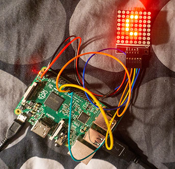

# MIDI Chords

Display basic chords played on an digital piano on a Max7219 8x8 pixel screen.  
For testing, code has been run on a Raspberry Pi B 2 which is conntected to the Max7219 8x8 LED screen

Presentation: <https://vimeo.com/399712566>

Library used for receiving MIDI messages: python-rtmidi by SpotlightKid  
Library used for communicating with the max7219: luma.led_matrix by rm-hull
